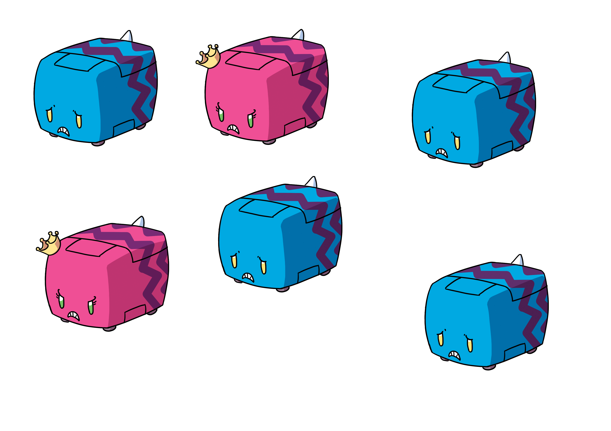

# Lesson 2: List, Boolean and Condition

> This lesson learns are based on Python book page 26-30


## Tools
[https://trinket.io/](https://trinket.io/)


## Lesson Learns

### What is the list?

When you want to store a lot of data, or perhaps the order of the data is important, you may need to use a list. A list can hold many items together and keep them in order. Python gives each item a number that shows its position in the list. You can change the items in the list at any time.

#### Not a good example
```python
my_friend_0 = "James"
my_friend_1 = "David"
my_friend_2 = "Anthony"
my_friend_3 = "Larry"
```
#### Using List
```python
friends = ["James", "David", "Anthony", "Larry"]
```
#### Getting a item from a list
```python
friends = ["James", "David", "Anthony", "Larry"]
print(len(friends)) # 4
print(friends[0])   # James
print(friends[1])   # David
print(friends[2])   # Anthony
print(friends[3])   # Larry
```
::: details output
```
4
James
David
Anthony
Larry
```
:::

### Boolean, Logic and Condition

#### Boolean
There are only True or False values for a boolean value.
```python
bool1 = True
print(bool1)
bool2 = False
print(bool2)
```
::: details output
```
True
False
```
:::

#### Logical operators

| Symbol | Meaning |
| --|---|
| == | equal
|!=| not equal
|<| less than
|>| greater than
|<=| less than or equal
|>= | greater than or equal


#### Pink and Blue bees




```python
pink_bees = 2
blue_bees = 4

answer1 = pink_bees > 5
answer2 = blue_bees < pink_bees 
answer3 = blue_bees >= 1
answer4 = pink_bees > 20

print(answer1)
print(answer2)
print(answer3)
print(answer4)
```
::: details output
```
False
False
True
False
```
:::

#### Condition
::: warning
Please be careful about **Indent**

```
if ...
	print()
^^^^ 1 tab
```
:::
```python
pink_bees = 2
blue_bees = 4
if(pink_bees < blue_bees):
	print("There are Pink Bees less than Blue Bees.")
```
::: details output
```
There are Pink Bees less than Blue Bees.
```
:::
```python
pink_bees = 5
blue_bees = 4
if(pink_bees < blue_bees):
	print("There are Pink Bees less than Blue Bees.")
```
::: details output
```
```
:::
```python{5,6}
pink_bees = 5
blue_bees = 4
if(pink_bees < blue_bees):
	print("There are Pink Bees less than Blue Bees.")
else:
	print("There are Pink Bees more than Blue Bees.")
```
::: details output
```
There are Pink Bees more than Blue Bees.
```
:::
<!--stackedit_data:
eyJoaXN0b3J5IjpbMTA0NDUxMDA5MiwxOTkyODI1MjIzLDE0Nz
E4MTMxNTksNzMwOTk4MTE2XX0=
-->