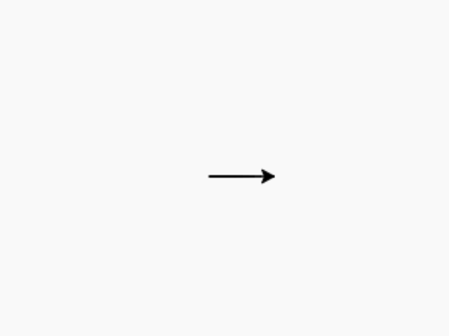
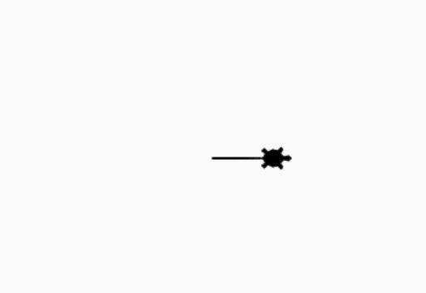
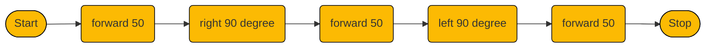
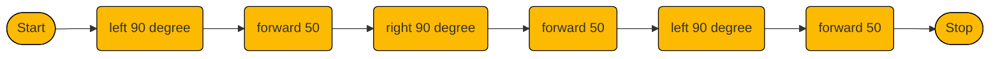
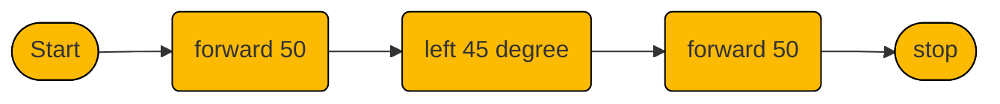
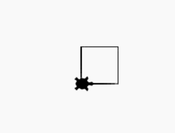
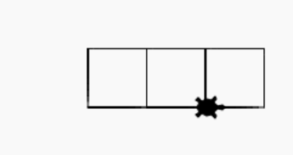

# Lesson 5: Robot and Turtle

## Tools
[https://trinket.io/](https://trinket.io/)

## Exercises
PythonExercise.pdf Page 10-11

## Coding Challenge

main.py
```python
from turtle import *

my_turtle = Turtle()
my_turtle.goto(0,0)
my_turtle.goto(50,0)
```
output



***

main.py
```python{4}
from turtle import *

my_turtle = Turtle()
my_turtle.shape("turtle")
my_turtle.goto(0,0)
my_turtle.goto(50,0)
```
output



***

main.py
```python{6}
from turtle import *

my_turtle = Turtle()
my_turtle.shape("turtle")
my_turtle.goto(0,0)
my_turtle.forward(50)
```
output


## Exercises

<svg class="draw" viewBox="0 0 100 100">
  <polyline points="0,25 50,25 50,75 100,75"
  style="fill:none;stroke:black;stroke-width:3" />
</svg>




::: details Click here for Solution
main.py
```python
from turtle import *

my_turtle = Turtle()
my_turtle.shape("turtle")

my_turtle.forward(50)
my_turtle.right(90)
my_turtle.forward(50)
my_turtle.left(90)
my_turtle.forward(50)
```
:::

<svg class="draw" viewBox="0 0 100 100">
  <polyline points="10,100 10,50 60,50 60,0"
  style="fill:none;stroke:black;stroke-width:3" />
</svg>




::: details Click here for Solution
main.py
```python
from turtle import *

my_turtle = Turtle()
my_turtle.shape("turtle")

my_turtle.left(90)
my_turtle.forward(50)
my_turtle.right(90)
my_turtle.forward(50)
my_turtle.left(90)
my_turtle.forward(50)
```
:::


<svg class="draw" viewBox="0 0 100 100">
  <polyline points="0,90 50,90 92.5,47.5"
  style="fill:none;stroke:black;stroke-width:3" />
</svg>



::: details Click here for Solution
main.py
```python
from turtle import *

my_turtle = Turtle()
my_turtle.shape("turtle")


my_turtle.forward(50)
my_turtle.left(45)
my_turtle.forward(50)
```
:::

## Lesson Learns

### Function
- Basically, **function** is a group of command.

main.py
```python{6-13}
from turtle import *

my_turtle = Turtle()
my_turtle.shape("turtle")

my_turtle.forward(50)
my_turtle.left(90)
my_turtle.forward(50)
my_turtle.left(90)
my_turtle.forward(50)
my_turtle.left(90)
my_turtle.forward(50)
my_turtle.left(90)
```
- As you can see code line 6-13. They are creating a rectangle. We can make it into one group.
  
output




main.py
```python{6,16}
from turtle import *

my_turtle = Turtle()
my_turtle.shape("turtle")

def rect():
    my_turtle.forward(50)
    my_turtle.left(90)
    my_turtle.forward(50)
    my_turtle.left(90)
    my_turtle.forward(50)
    my_turtle.left(90)
    my_turtle.forward(50)
    my_turtle.left(90)

rect()
```

- Draws more rectangles

main.py
```python{16-20}
from turtle import *

my_turtle = Turtle()
my_turtle.shape("turtle")

def rect():
    my_turtle.forward(50)
    my_turtle.left(90)
    my_turtle.forward(50)
    my_turtle.left(90)
    my_turtle.forward(50)
    my_turtle.left(90)
    my_turtle.forward(50)
    my_turtle.left(90)

rect()
my_turtle.forward(50)
rect()
my_turtle.forward(50)
rect()
```
output



- Refactor our code

main.py
```python{7-9}
from turtle import *

my_turtle = Turtle()
my_turtle.shape("turtle")

def rect():
    for i in range(4):
      my_turtle.forward(50)
      my_turtle.left(90)


rect()
my_turtle.forward(50)
rect()
my_turtle.forward(50)
rect()

```