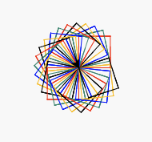

# Lesson 6: Square Spirograph

## Tools
[https://trinket.io/](https://trinket.io/)


## Lesson Learns

### Object attributes
- Turtle object has many attributes which we can define how our turtle should be or act.

#### [shape](https://docs.python.org/3/library/turtle.html#turtle.shape)

- arrow, turtle, circle, square, triangle, classic

main.py
```python{4}
from turtle import *

my_turtle = Turtle()
my_turtle.shape("arrow") # try arrow, turtle, circle, square, triangle, classic
```

#### [speed](https://docs.python.org/3/library/turtle.html#turtle.speed)
- an **integer** in the range 0-10 or a speedstring

main.py
```python{5}
from turtle import *

my_turtle = Turtle()

my_turtle.speed(1) # try 0 - 10
my_turtle.forward(50)
```

#### [color](https://docs.python.org/3/library/turtle.html#turtle.color)
- a string or HEX color code

main.py
```python{5,7}
from turtle import *

my_turtle = Turtle()

my_turtle.color("#148F77")
my_turtle.forward(50)
my_turtle.color("red")
my_turtle.forward(50)
```
::: details output

:::
#### [pensize](https://docs.python.org/3/library/turtle.html#turtle.pensize)
- a positive number

main.py
```python{5,7}
from turtle import *

my_turtle = Turtle()

my_turtle.pensize(1)
my_turtle.forward(50)
my_turtle.pensize(5)
my_turtle.forward(50)
```
::: details output

:::

## Code a Square Spirograph

### Step 1: create a square

main.py
```python
from turtle import *

my_turtle = Turtle()

def rect():
    for i in range(4):
        my_turtle.forward(50)
        my_turtle.left(90)
      
rect()
```
::: details output

:::

### Step 2: More!

main.py
```python{11,12}
from turtle import *

my_turtle = Turtle()

def rect():
    for i in range(4):
        my_turtle.forward(50)
        my_turtle.left(90)
      
rect()
my_turtle.left(12)
rect()
```
::: details output

:::

### Step 3: More and More and More! with loop

main.py
```python{10,11,12}
from turtle import *

my_turtle = Turtle()

def rect():
    for i in range(4):
        my_turtle.forward(50)
        my_turtle.left(90)
      
for i in range(10):
    rect()
    my_turtle.left(12)
```
::: details output

:::

### Step 4: Set speed and pensize

main.py
```python{4,5}
from turtle import *

my_turtle = Turtle()
my_turtle.speed(10)
my_turtle.pensize(1)


def rect():
    for i in range(4):
        my_turtle.forward(50)
        my_turtle.left(90)
      
for i in range(10):
    rect()
    my_turtle.left(12)
```
::: details output

:::


### Step 5: Coloring

main.py
```python{13,14}
from turtle import *

my_turtle = Turtle()
my_turtle.speed(10)
my_turtle.pensize(1)


def rect():
    for i in range(4):
        my_turtle.forward(50)
        my_turtle.left(90)
      
for each_color in ["red","#148F77","blue","#FFC300","black"]:
    my_turtle.color(each_color)
    rect()
    my_turtle.left(12)
```
::: details output

:::

### Step 6: Repeat this Spirograph again and again

main.py
```python{13}
from turtle import *

my_turtle = Turtle()
my_turtle.speed(10)
my_turtle.pensize(1)


def rect():
    for i in range(4):
        my_turtle.forward(50)
        my_turtle.left(90)

for i in range(5): 
    for each_color in ["red","#148F77","blue","#FFC300","black"]:
        my_turtle.color(each_color)
        rect()
        my_turtle.left(12)
```

::: details output

:::