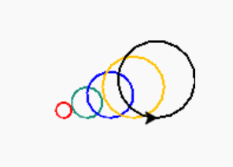
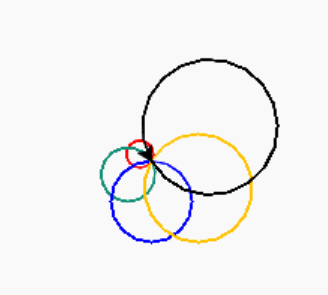

# Lesson 7: Circle spiral

> This lesson learns are based on Python book page 82-89


## Tools
[https://trinket.io/](https://trinket.io/)

## Lesson Learns

### [Penup](https://docs.python.org/3/library/turtle.html#turtle.penup) and [Pendown](https://docs.python.org/3/library/turtle.html#turtle.pendown)

main.py
```python
from turtle import *

my_turtle = Turtle()

my_turtle.forward(50)
my_turtle.forward(50)
```

main.py
```python{5,7}
from turtle import *

my_turtle = Turtle()

my_turtle.penup()
my_turtle.forward(50)
my_turtle.pendown()
my_turtle.forward(50)
```

## Codeing

### Circle

- start a circle
  
main.py
```python
from turtle import *

my_turtle = Turtle()

my_turtle.circle(10)
my_turtle.circle(20)
my_turtle.circle(30)
```

- refactor

main.py
```python{5,6}
from turtle import *

my_turtle = Turtle()

for i in range(3):
    my_turtle.circle( 10*(i+1) )
```

- Coloring

main.py
```python{5,6}
from turtle import *

my_turtle = Turtle()

for i, each_color in enumerate(["red","#148F77","blue","#FFC300","black"]):
    my_turtle.color(each_color)
    my_turtle.circle( 10*(i+1) )
```

- More effects

main.py
```python{6-8}
from turtle import *

my_turtle = Turtle()

for i, each_color in enumerate(["red","#148F77","blue","#FFC300","black"]):
    my_turtle.penup()
    my_turtle.forward(30)
    my_turtle.pendown()
  
    my_turtle.color(each_color)
    my_turtle.circle( 10*(i+1) )
```
output



main.py
```python{6}
from turtle import *

my_turtle = Turtle()

for i, each_color in enumerate(["red","#148F77","blue","#FFC300","black"]):
    my_turtle.left(60)
  
    my_turtle.color(each_color)
    my_turtle.circle( 10*(i+1) )
```
output

