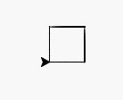
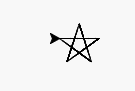
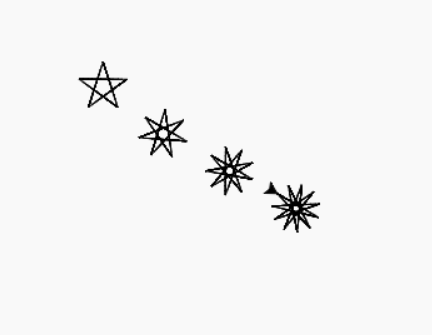
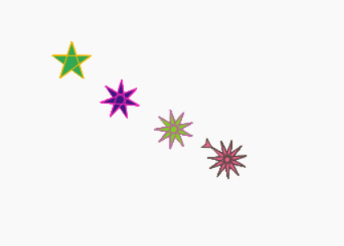

# Lesson 8: Star(s)

> This lesson learns are based on Python book page 90-97


## Tools
[https://trinket.io/](https://trinket.io/)


## Lesson Leans

## Function Argument(s)

main.py
```python
print(1+2)
print(4+5)
```
::: details output
```
3
9
```
:::
main.py
```python
def find_sum(a,b):
    print(a+b)

find_sum(1, 2)
find_sum(4, 5)
```
::: details output
```
3
9
```
:::
### Fills the color

main.py

```python
from turtle import *

my_turtle = Turtle()

def rect():
    for i in range(4):
        my_turtle.forward(50)
        my_turtle.left(90)

rect()
```
::: details output

:::

#### Add line color

main.py

```python{7}

from turtle import *

my_turtle = Turtle()

def rect():
    my_turtle.color("#fcba03")
    for i in range(4):
        my_turtle.forward(50)
        my_turtle.left(90)

rect()
```
::: details output

:::

#### Fills the color

main.py

```python{7,8,12}
from turtle import *

my_turtle = Turtle()

def rect():
    my_turtle.color("#fcba03")
    my_turtle.fillcolor("#32a852")
    my_turtle.begin_fill()
    for i in range(4):
        my_turtle.forward(50)
        my_turtle.left(90)
    my_turtle.end_fill()

rect()
```
::: details output

:::

### Create a Star!

```py{5,7}
from turtle import *

my_turtle = Turtle()

def star(n_point):
    angle = 180 - (180/n_point)
    for i in range(n_point):
        my_turtle.forward(50)
        my_turtle.right(angle)
  
star(5)
```
::: details output

:::

```py{11-19,22,25,27,29}
from turtle import *

my_turtle = Turtle()

def star(n_point):
    angle = 180 - (180/n_point)
    for i in range(n_point):
        my_turtle.forward(50)
        my_turtle.right(angle)

def move_pen_to(x, y):
    my_turtle.penup()
    my_turtle.goto(x, y)
    my_turtle.pendown()

def move_pen_forward(distance):
    my_turtle.penup()
    my_turtle.forward(distance)
    my_turtle.pendown()    


move_pen_to(-100,100)
star(5)
my_turtle.right(30)
move_pen_forward(80)
star(7)
move_pen_forward(80)
star(9)
move_pen_forward(80)
star(11)
```

::: details output


:::
### Add the color!
```py{5,27,30,32,34}
from turtle import *

my_turtle = Turtle()

def star(n_point, line_color, fill_color):
    angle = 180 - (180/n_point)
    my_turtle.color(line_color)
    my_turtle.fillcolor(fill_color)
    my_turtle.begin_fill()
    for i in range(n_point):
        my_turtle.forward(50)
        my_turtle.right(angle)
    my_turtle.end_fill()

def move_pen_to(x, y):
    my_turtle.penup()
    my_turtle.goto(x, y)
    my_turtle.pendown()

def move_pen_forward(distance):
    my_turtle.penup()
    my_turtle.forward(distance)
    my_turtle.pendown()    


move_pen_to(-100,100)
star(5,"#fcba03","#32a852")
my_turtle.right(30)
move_pen_forward(80)
star(7,"#F626B5","#3B1780")
move_pen_forward(80)
star(9,"#B664A0","#82CD21")
move_pen_forward(80)
star(11,"#55483E","#EC6091")
```
::: details output

:::
