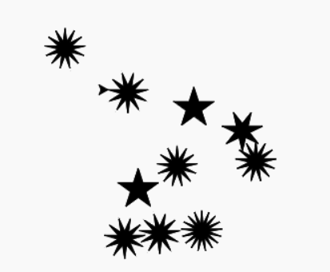
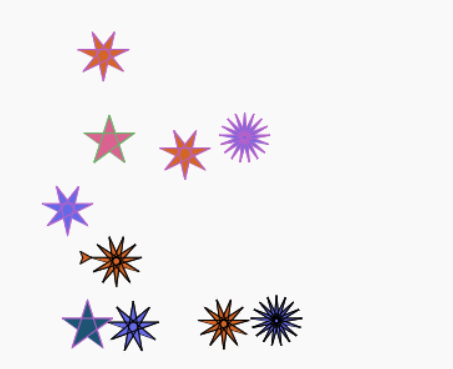

# Lesson 9: Starry Night

> This lesson learns are based on Python book page 90-97


## Tools
[https://trinket.io/](https://trinket.io/)

## Lesson Leans

### Random Package

- learn how to use a Random number in Python!

```python
from random import randint

print(randint(1,10))
```

```python
from random import randint

for i in range(10):
    print(randint(1,10))
```

#### Task

- try to run this code 3 times.

### Seed 

- However, you might see everytime you run the code again. The random number would change everytime. We can use Seed number for fixed sequence.
- Seed can be anything. For instance, it can be number or string.


```python{4}
import random
from random import randint

random.seed(555)

for i in range(10):
    print(randint(1,10))
```

output
```
8
1
10
7
6
2
10
4
7
5
```

```python{4}
import random
from random import randint

random.seed("some string")

for i in range(10):
    print(randint(1,10))
```

output
```
6
8
7
6
5
7
5
9
10
4
```

### Random from List

```python{6,9}
import random
from random import choice

random.seed(555)

possible_point_stars = [5,7,9,11]

for i in range(10):
    print(choice(possible_point_stars))
```

output
```
9
5
11
9
9
5
11
7
9
7
```

## Starry Night

### Previous code

main.py
```py
from turtle import *

my_turtle = Turtle()

def star(n_point, line_color, fill_color):
    angle = 180 - (180/n_point)
    my_turtle.color(line_color)
    my_turtle.fillcolor(fill_color)
    my_turtle.begin_fill()
    for i in range(n_point):
        my_turtle.forward(50)
        my_turtle.right(angle)
    my_turtle.end_fill()

def move_pen_to(x, y):
    my_turtle.penup()
    my_turtle.goto(x, y)
    my_turtle.pendown()

def move_pen_forward(distance):
    my_turtle.penup()
    my_turtle.forward(distance)
    my_turtle.pendown()    
```

### Start coding the Starry Night!

main.py
```py{5,7,30-36}
from turtle import *
import random
from random import choice,randint

random.seed(555)
my_turtle = Turtle()
my_turtle.speed(0)


def star(n_point, line_color, fill_color):
    angle = 180 - (180/n_point)
    my_turtle.color(line_color)
    my_turtle.fillcolor(fill_color)
    my_turtle.begin_fill()
    for i in range(n_point):
        my_turtle.forward(50)
        my_turtle.right(angle)
    my_turtle.end_fill()

def move_pen_to(x, y):
    my_turtle.penup()
    my_turtle.goto(x, y)
    my_turtle.pendown()

def move_pen_forward(distance):
    my_turtle.penup()
    my_turtle.forward(distance)
    my_turtle.pendown()    
    
possible_star_points = [5,9,7,11,13,15,17]
for i in range(10):
    x = randint(-150,150)
    y = randint(-150,150)
    star_point = choice(possible_star_points)
    move_pen_to(x,y)
    star(star_point, "black", "black")
```
output



### Coloring

main.py
```py{31,32,37,38,41}
from turtle import *
import random
from random import choice,randint

random.seed(555)
my_turtle = Turtle()
my_turtle.speed(0)


def star(n_point, line_color, fill_color):
    angle = 180 - (180/n_point)
    my_turtle.color(line_color)
    my_turtle.fillcolor(fill_color)
    my_turtle.begin_fill()
    for i in range(n_point):
        my_turtle.forward(50)
        my_turtle.right(angle)
    my_turtle.end_fill()

def move_pen_to(x, y):
    my_turtle.penup()
    my_turtle.goto(x, y)
    my_turtle.pendown()

def move_pen_forward(distance):
    my_turtle.penup()
    my_turtle.forward(distance)
    my_turtle.pendown()    
    
possible_star_points = [5,9,7,11,13,15,17]
line_colors = ["#65B667","#B561C9","black"]
fill_colors = ["#DA6291","#D36527","#6569E6","#1D5474"]
for i in range(10):
    x = randint(-150,150)
    y = randint(-150,150)
    star_point = choice(possible_star_points)
    line_color = choice(line_colors)
    fill_color = choice(fill_colors)

    move_pen_to(x,y)
    star(star_point, line_color, fill_color)
```

output


