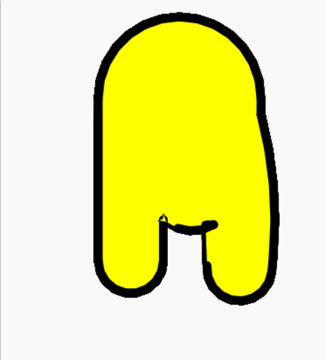
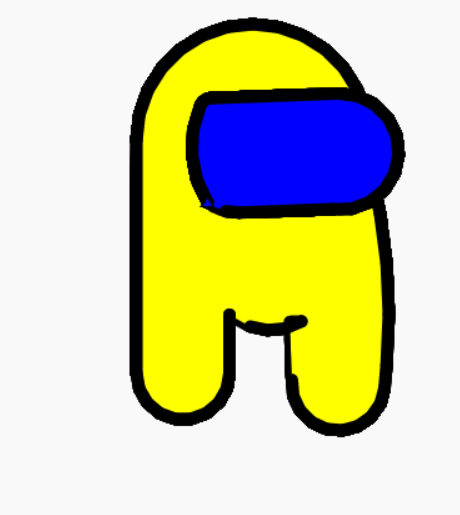
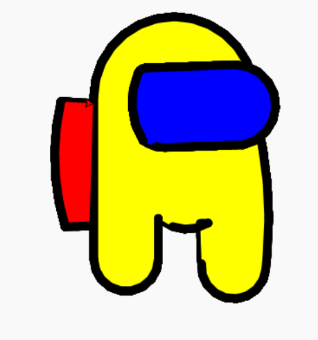

# Project 1: Amoung us

> This lesson learns are based on [copyassignment.com](https://copyassignment.com/draw-among-us-character-with-python-turtle/)

## Tools
[https://trinket.io/](https://trinket.io/)

## Get Started!

main.py

```py
from turtle import *

my_turtle = Turtle()

body_color = "yellow"
glasses_color = "blue"
line_color = "black"
```

## Add helper function

```py{10-13,16-19}
from turtle import *

my_turtle = Turtle()

body_color = "yellow"
glasses_color = "blue"
line_color = "black"


def move_pen_to(x, y):
    my_turtle.penup()
    my_turtle.goto(x, y)
    my_turtle.pendown()


def move_pen_forward(distance):
    my_turtle.penup()
    my_turtle.forward(distance)
    my_turtle.pendown()    
```

### Body


#### Step 1 

```py{22-24,25,29}
from turtle import *

my_turtle = Turtle()

body_color = "yellow"
glasses_color = "blue"
line_color = "black"


def move_pen_to(x, y):
    my_turtle.penup()
    my_turtle.goto(x, y)
    my_turtle.pendown()


def move_pen_forward(distance):
    my_turtle.penup()
    my_turtle.forward(distance)
    my_turtle.pendown()    


def draw_body():
    my_turtle.color(line_color)
    my_turtle.fillcolor(body_color)
    my_turtle.begin_fill()

    my_turtle.circle(100, -180)

    my_turtle.end_fill()


draw_body()
```

#### Step 2


```py{27-32,34-35,37-40,42-44,46-50,52-53,57-58}
from turtle import *

my_turtle = Turtle()

body_color = "yellow"
glasses_color = "blue"
line_color = "black"


def move_pen_to(x, y):
    my_turtle.penup()
    my_turtle.goto(x, y)
    my_turtle.pendown()


def move_pen_forward(distance):
    my_turtle.penup()
    my_turtle.forward(distance)
    my_turtle.pendown()    


def draw_body():
    my_turtle.color(line_color)
    my_turtle.fillcolor(body_color)
    my_turtle.begin_fill()

    my_turtle.right(90)
    my_turtle.forward(50)
    my_turtle.right(180)
    my_turtle.circle(40, -180)
    my_turtle.right(180)
    my_turtle.forward(200)

    my_turtle.right(180)
    my_turtle.circle(100, -180)

    my_turtle.backward(20)
    my_turtle.left(15)
    my_turtle.circle(500, -20)
    my_turtle.backward(20)

    my_turtle.circle(40, -180)
    my_turtle.left(7)
    my_turtle.backward(50)

    my_turtle.up()
    my_turtle.left(90)
    my_turtle.forward(10)
    my_turtle.right(90)
    my_turtle.down()

    my_turtle.right(240)
    my_turtle.circle(50, -70)

    my_turtle.end_fill()

move_pen_to(0,-70)
my_turtle.pensize(10)
draw_body()
```

output



### Glasses


#### Step 1
```py{58-61,64,70}
from turtle import *

my_turtle = Turtle()

body_color = "yellow"
glasses_color = "blue"
line_color = "black"


def move_pen_to(x, y):
    my_turtle.penup()
    my_turtle.goto(x, y)
    my_turtle.pendown()


def move_pen_forward(distance):
    my_turtle.penup()
    my_turtle.forward(distance)
    my_turtle.pendown()    


def draw_body():
    my_turtle.color(line_color)
    my_turtle.fillcolor(body_color)
    my_turtle.begin_fill()

    my_turtle.right(90)
    my_turtle.forward(50)
    my_turtle.right(180)
    my_turtle.circle(40, -180)
    my_turtle.right(180)
    my_turtle.forward(200)

    my_turtle.right(180)
    my_turtle.circle(100, -180)

    my_turtle.backward(20)
    my_turtle.left(15)
    my_turtle.circle(500, -20)
    my_turtle.backward(20)

    my_turtle.circle(40, -180)
    my_turtle.left(7)
    my_turtle.backward(50)

    my_turtle.up()
    my_turtle.left(90)
    my_turtle.forward(10)
    my_turtle.right(90)
    my_turtle.down()

    my_turtle.right(240)
    my_turtle.circle(50, -70)

    my_turtle.end_fill()


def draw_glasses():
    my_turtle.color(line_color)
    my_turtle.fillcolor(glasses_color)
    my_turtle.begin_fill()


    my_turtle.end_fill()


move_pen_to(0,-70)
my_turtle.pensize(10)
draw_body()
draw_glasses()
```


#### Step 2
```py{59-65,71-72,74-80,82-84,86-87}
from turtle import *

my_turtle = Turtle()

body_color = "yellow"
glasses_color = "blue"
line_color = "black"


def move_pen_to(x, y):
    my_turtle.penup()
    my_turtle.goto(x, y)
    my_turtle.pendown()


def move_pen_forward(distance):
    my_turtle.penup()
    my_turtle.forward(distance)
    my_turtle.pendown()    


def draw_body():
    my_turtle.color(line_color)
    my_turtle.fillcolor(body_color)
    my_turtle.begin_fill()

    my_turtle.right(90)
    my_turtle.forward(50)
    my_turtle.right(180)
    my_turtle.circle(40, -180)
    my_turtle.right(180)
    my_turtle.forward(200)

    my_turtle.right(180)
    my_turtle.circle(100, -180)

    my_turtle.backward(20)
    my_turtle.left(15)
    my_turtle.circle(500, -20)
    my_turtle.backward(20)

    my_turtle.circle(40, -180)
    my_turtle.left(7)
    my_turtle.backward(50)

    my_turtle.up()
    my_turtle.left(90)
    my_turtle.forward(10)
    my_turtle.right(90)
    my_turtle.down()

    my_turtle.right(240)
    my_turtle.circle(50, -70)

    my_turtle.end_fill()


def draw_glasses():
    my_turtle.penup()
    my_turtle.right(230)
    my_turtle.forward(100)
    my_turtle.left(90)
    my_turtle.forward(20)
    my_turtle.right(90)
    my_turtle.pendown()

    my_turtle.color(line_color)
    my_turtle.fillcolor(glasses_color)
    my_turtle.begin_fill()

    my_turtle.right(150)
    my_turtle.circle(90, -55)

    my_turtle.right(180)
    my_turtle.forward(1)
    my_turtle.right(180)
    my_turtle.circle(10, -65)
    my_turtle.right(180)
    my_turtle.forward(110)
    my_turtle.right(180)
    
    my_turtle.circle(50, -190)
    my_turtle.right(170)
    my_turtle.forward(80)

    my_turtle.right(180)
    my_turtle.circle(45, -30)

    my_turtle.end_fill()


move_pen_to(0,-70)
my_turtle.pensize(10)
draw_body()
draw_glasses()
```

output




### Bag


```py{7,93-99,101-103,105-106,108-110,112,119}
from turtle import *

my_turtle = Turtle()

body_color = "yellow"
glasses_color = "blue"
bag_color = "red"
line_color = "black"


def move_pen_to(x, y):
    my_turtle.penup()
    my_turtle.goto(x, y)
    my_turtle.pendown()


def move_pen_forward(distance):
    my_turtle.penup()
    my_turtle.forward(distance)
    my_turtle.pendown()    


def draw_body():
    my_turtle.color(line_color)
    my_turtle.fillcolor(body_color)
    my_turtle.begin_fill()

    my_turtle.right(90)
    my_turtle.forward(50)
    my_turtle.right(180)
    my_turtle.circle(40, -180)
    my_turtle.right(180)
    my_turtle.forward(200)

    my_turtle.right(180)
    my_turtle.circle(100, -180)

    my_turtle.backward(20)
    my_turtle.left(15)
    my_turtle.circle(500, -20)
    my_turtle.backward(20)

    my_turtle.circle(40, -180)
    my_turtle.left(7)
    my_turtle.backward(50)

    my_turtle.up()
    my_turtle.left(90)
    my_turtle.forward(10)
    my_turtle.right(90)
    my_turtle.down()

    my_turtle.right(240)
    my_turtle.circle(50, -70)

    my_turtle.end_fill()


def draw_glasses():
    my_turtle.penup()
    my_turtle.right(230)
    my_turtle.forward(100)
    my_turtle.left(90)
    my_turtle.forward(20)
    my_turtle.right(90)
    my_turtle.pendown()

    my_turtle.color(line_color)
    my_turtle.fillcolor(glasses_color)
    my_turtle.begin_fill()

    my_turtle.right(150)
    my_turtle.circle(90, -55)

    my_turtle.right(180)
    my_turtle.forward(1)
    my_turtle.right(180)
    my_turtle.circle(10, -65)
    my_turtle.right(180)
    my_turtle.forward(110)
    my_turtle.right(180)
    
    my_turtle.circle(50, -190)
    my_turtle.right(170)
    my_turtle.forward(80)

    my_turtle.right(180)
    my_turtle.circle(45, -30)

    my_turtle.end_fill()


def draw_bag():
    my_turtle.penup()
    my_turtle.right(60)
    my_turtle.forward(100)
    my_turtle.right(90)
    my_turtle.forward(75)
    my_turtle.pendown()

    my_turtle.color(line_color)
    my_turtle.fillcolor(bag_color)
    my_turtle.begin_fill()

    my_turtle.forward(30)
    my_turtle.right(255)

    my_turtle.circle(300, -30)
    my_turtle.right(260)
    my_turtle.forward(40)

    my_turtle.end_fill()


move_pen_to(0,-70)
my_turtle.pensize(10)
draw_body()
draw_glasses()
draw_bag()
```

output


